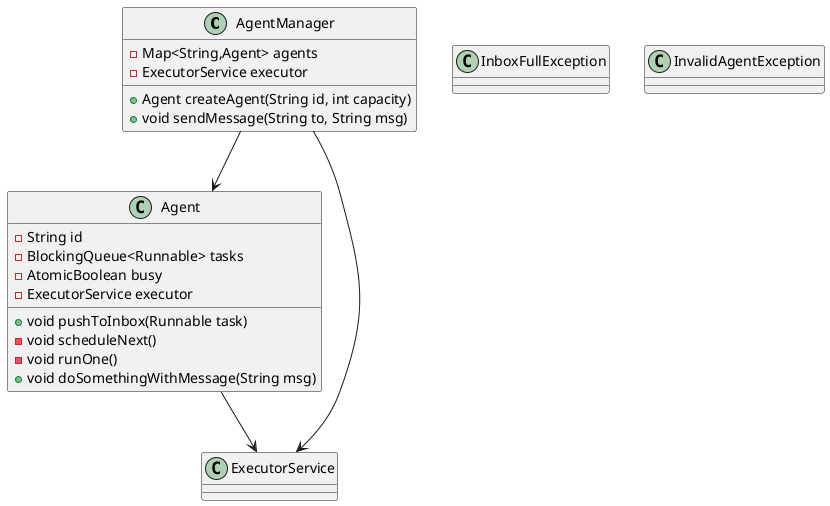

# Agent Messaging System

This document describes the design and implementation of a concurrent agent messaging system where multiple agents share a thread pool, process messages one-at-a-time per agent, and ensure fair scheduling.

---

## Requirements

1. **Shared Thread Pool**

   * All Agents must share a fixed-size `ExecutorService` to cap total threads.

2. **Per-Agent Serialization**

   * Each Agent processes **at most one** message at a time.

3. **Fair Scheduling Across Agents**

   * No single Agent can monopolize the pool.
   * New tasks are enqueued at the end of the pool’s FIFO queue, giving other Agents a turn.

4. **Bounded Inbox with Backpressure**

   * Each Agent has a bounded `BlockingQueue<Runnable>` for pending tasks.
   * If the inbox is full, an `InboxFullException` is thrown.

5. **No Task Loss**

   * Under overload, tasks never get rejected silently.
   * Optionally use a bounded global queue with `CallerRunsPolicy` to avoid rejections.

---

## UML Diagram



---

## Implementation

### Exceptions

```java
public class InboxFullException extends Exception {
    public InboxFullException(String msg) { super(msg); }
}

public class InvalidAgentException extends Exception {
    public InvalidAgentException(String msg) { super(msg); }
}
```

### AgentManager.java

```java
import java.util.concurrent.*;
import java.util.Map;
import java.util.concurrent.ConcurrentHashMap;

public class AgentManager {
    private final Map<String, Agent> agents = new ConcurrentHashMap<>();
    private final ExecutorService executor;

    public AgentManager(int poolSize) {
        this.executor = Executors.newFixedThreadPool(poolSize);
    }

    public Agent createAgent(String id, int inboxCapacity) {
        if (agents.putIfAbsent(id, new Agent(id, inboxCapacity, executor)) != null) {
            throw new IllegalArgumentException("Agent already exists: " + id);
        }
        return agents.get(id);
    }

    public void sendMessage(String to, String msg)
            throws InboxFullException, InvalidAgentException {
        Agent a = agents.get(to);
        if (a == null) throw new InvalidAgentException("Unknown agent: " + to);
        a.pushToInbox(() -> a.doSomethingWithMessage(msg));
    }
}
```

### Agent.java

```java
import java.util.concurrent.*;
import java.util.concurrent.atomic.AtomicBoolean;

public class Agent {
    private final String id;
    private final BlockingQueue<Runnable> tasks;
    private final ExecutorService executor;
    private final AtomicBoolean busy = new AtomicBoolean(false);

    public Agent(String id, int capacity, ExecutorService executor) {
        this.id = id;
        this.tasks = new ArrayBlockingQueue<>(capacity);
        this.executor = executor;
    }

    public void pushToInbox(Runnable task) throws InboxFullException {
        if (!tasks.offer(task)) {
            throw new InboxFullException("Inbox full for " + id);
        }
        scheduleNext();
    }

    private void scheduleNext() {
        if (busy.compareAndSet(false, true)) {
            executor.submit(() -> {
                try {
                    Runnable next = tasks.poll();
                    if (next != null) next.run();
                } finally {
                    busy.set(false);
                    if (!tasks.isEmpty()) {
                        scheduleNext();
                    }
                }
            });
        }
    }

    protected void doSomethingWithMessage(String message) {
        System.out.printf("[%s] processing: %s%n", id, message);
    }
}
```

---

## Why It Works

1. **Concurrency Control**:

   * All Agents use a shared, fixed-size thread pool (`ExecutorService`) so at most *poolSize* threads run concurrently.

2. **Per-Agent Serialization**:

   * Each Agent’s `busy` flag ensures only one task is ever submitted at a time.
   * After completion, the flag resets and if more tasks remain, a new submission occurs.

3. **Fair Scheduling**:

   * Every `pushToInbox` enqueues a `Runnable` to the agent’s private queue and attempts scheduling.
   * Since only one task is queued/submitted at any moment, and resubmission happens **after** execution, each task re-enters the global pool’s queue tail—ensuring no Agent can starve others.

4. **Bounded Inbox & Backpressure**:

   * The `ArrayBlockingQueue<Runnable>` enforces a hard cap per-Agent.
   * Overflow throws `InboxFullException`, allowing callers to react or retry.

5. **No Silent Failures**:

   * By default the global pool’s queue is unbounded; if you prefer limiting it, swap in a custom `ThreadPoolExecutor` with a bounded queue and `CallerRunsPolicy` to have the finishing thread execute the next task inline rather than rejecting.

---
