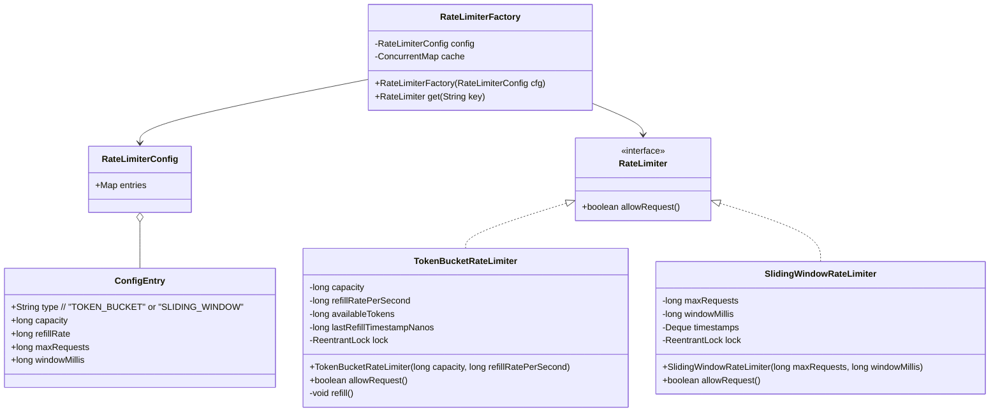

## Extension: Configuration & Factory

1. **Configuration**  
   - A `RateLimiterConfig` holds per-client/API settings (type + parameters).  
2. **Factory**  
   - `RateLimiterFactory` reads that config and returns a (cached) `RateLimiter` instance for a given key.  
3. **Pluggable algorithms**  
   - We already have `TokenBucketRateLimiter`.  
   - Add `SlidingWindowRateLimiter` implementing the same interface.  

---

## Updated UML / Class Diagram


### Java Code

```java
import java.time.Duration;
import java.util.*;
import java.util.concurrent.ConcurrentHashMap;
import java.util.concurrent.ConcurrentMap;
import java.util.concurrent.locks.ReentrantLock;

/** Core interface */
public interface RateLimiter {
    boolean allowRequest();
}

/** Token Bucket implementation (as before) */
public class TokenBucketRateLimiter implements RateLimiter {
    private final long capacity;
    private final long refillRatePerSecond;
    private long availableTokens;
    private long lastRefillTimestampNanos;
    private final ReentrantLock lock = new ReentrantLock();

    public TokenBucketRateLimiter(long capacity, long refillRatePerSecond) {
        this.capacity = capacity;
        this.refillRatePerSecond = refillRatePerSecond;
        this.availableTokens = capacity;
        this.lastRefillTimestampNanos = System.nanoTime();
    }

    @Override
    public boolean allowRequest() {
        refill();
        lock.lock();
        try {
            if (availableTokens > 0) {
                availableTokens--;
                return true;
            }
            return false;
        } finally {
            lock.unlock();
        }
    }

    private void refill() {
        long now = System.nanoTime();
        long delta = now - lastRefillTimestampNanos;
        long tokens = (delta * refillRatePerSecond) / 1_000_000_000L;
        if (tokens > 0) {
            lock.lock();
            try {
                availableTokens = Math.min(capacity, availableTokens + tokens);
                lastRefillTimestampNanos = now;
            } finally {
                lock.unlock();
            }
        }
    }
}

/** Sliding Window implementation */
public class SlidingWindowRateLimiter implements RateLimiter {
    private final long maxRequests;
    private final long windowMillis;
    private final Deque<Long> timestamps = new LinkedList<>();
    private final ReentrantLock lock = new ReentrantLock();

    /**
     * @param maxRequests  max calls allowed per window
     * @param windowMillis window size in milliseconds
     */
    public SlidingWindowRateLimiter(long maxRequests, long windowMillis) {
        this.maxRequests = maxRequests;
        this.windowMillis = windowMillis;
    }

    @Override
    public boolean allowRequest() {
        long now = System.currentTimeMillis();
        lock.lock();
        try {
            // remove expired
            while (!timestamps.isEmpty() && timestamps.peekFirst() <= now - windowMillis) {
                timestamps.pollFirst();
            }
            if (timestamps.size() < maxRequests) {
                timestamps.addLast(now);
                return true;
            }
            return false;
        } finally {
            lock.unlock();
        }
    }
}

/** Holds the raw config entries (could be loaded from YAML/properties) */
public class RateLimiterConfig {
    public static class ConfigEntry {
        public String type;          // "TOKEN_BUCKET" or "SLIDING_WINDOW"
        public long capacity;        // for token bucket
        public long refillRate;      // for token bucket
        public long maxRequests;     // for sliding window
        public long windowMillis;    // for sliding window
    }

    private final Map<String, ConfigEntry> entries = new HashMap<>();

    public RateLimiterConfig() {
        // Example hard-coded entries; replace with real loading logic
        ConfigEntry e1 = new ConfigEntry();
        e1.type = "TOKEN_BUCKET";
        e1.capacity = 100; e1.refillRate = 50;
        entries.put("apiA", e1);

        ConfigEntry e2 = new ConfigEntry();
        e2.type = "SLIDING_WINDOW";
        e2.maxRequests = 10; e2.windowMillis = 1_000;
        entries.put("clientB", e2);
    }

    public ConfigEntry getEntry(String key) {
        return entries.get(key);
    }
}

/** Factory that builds and caches RateLimiter instances */
public class RateLimiterFactory {
    private final RateLimiterConfig config;
    private final ConcurrentMap<String, RateLimiter> cache = new ConcurrentHashMap<>();

    public RateLimiterFactory(RateLimiterConfig config) {
        this.config = config;
    }

    public RateLimiter get(String key) {
        return cache.computeIfAbsent(key, k -> {
            RateLimiterConfig.ConfigEntry entry = config.getEntry(k);
            if (entry == null) {
                throw new IllegalArgumentException("No rate-limit config for: " + k);
            }
            switch (entry.type) {
                case "TOKEN_BUCKET":
                    return new TokenBucketRateLimiter(entry.capacity, entry.refillRate);
                case "SLIDING_WINDOW":
                    return new SlidingWindowRateLimiter(entry.maxRequests, entry.windowMillis);
                default:
                    throw new IllegalArgumentException("Unknown limiter type: " + entry.type);
            }
        });
    }
}
```
