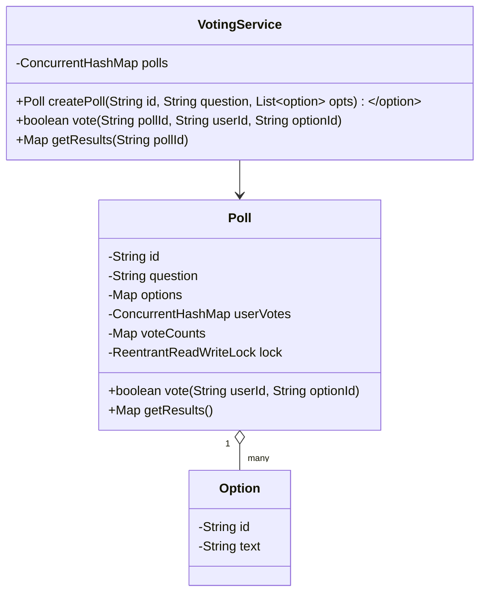

## High-Level Requirements

- **Poll management**: Create/delete polls, each with a question and a fixed set of options.  
- **Single vote per user**: Each user can vote at most once per poll; changing a vote updates counts.  
- **Accurate tallies**: Maintain and retrieve real-time vote counts.  
- **Concurrency & thread-safety**: Support concurrent voting without lost updates.  
- **Extensible storage**: In-memory now; pluggable for DB backing later.  

---

## Hint of Major Trick

Use a **per-poll ReentrantReadWriteLock** plus **ConcurrentHashMap** + **AtomicInteger** for counts.  
- Write-lock when modifying votes (add/remove) to keep counts consistent.  
- Read-lock for fetching results to avoid blocking other readers too long.  

---

## High-Level UML / Class Diagram



### Java Code

```java
import java.util.*;
import java.util.concurrent.*;
import java.util.concurrent.atomic.AtomicInteger;
import java.util.concurrent.locks.ReentrantReadWriteLock;
import java.util.stream.Collectors;

public class Option {
    private final String id;
    private final String text;
    public Option(String id, String text) {
        this.id = id; this.text = text;
    }
    public String getId() { return id; }
    public String getText() { return text; }
}

public class Poll {
    private final String id;
    private final String question;
    private final Map<String,Option> options = new HashMap<>();
    private final ConcurrentHashMap<String,String> userVotes = new ConcurrentHashMap<>();
    private final Map<String,AtomicInteger> voteCounts = new HashMap<>();
    private final ReentrantReadWriteLock lock = new ReentrantReadWriteLock();

    public Poll(String id, String question, List<Option> opts) {
        this.id = id;
        this.question = question;
        for (Option o : opts) {
            options.put(o.getId(), o);
            voteCounts.put(o.getId(), new AtomicInteger(0));
        }
    }

    /**
     * Cast or change a vote for this poll.
     * @return true if state changed; false if vote unchanged or invalid.
     */
    public boolean vote(String userId, String optionId) {
        if (!options.containsKey(optionId)) return false;
        lock.writeLock().lock();
        try {
            String prev = userVotes.put(userId, optionId);
            if (optionId.equals(prev)) {
                // user voted same option → no change
                return false;
            }
            // decrement old vote if any
            if (prev != null) {
                voteCounts.get(prev).decrementAndGet();
            }
            // increment new vote
            voteCounts.get(optionId).incrementAndGet();
            return true;
        } finally {
            lock.writeLock().unlock();
        }
    }

    /**
     * Get a snapshot of current tallies.
     */
    public Map<String,Integer> getResults() {
        lock.readLock().lock();
        try {
            return voteCounts.entrySet()
                .stream()
                .collect(Collectors.toMap(
                    Map.Entry::getKey,
                    e -> e.getValue().get()
                ));
        } finally {
            lock.readLock().unlock();
        }
    }
}
```
